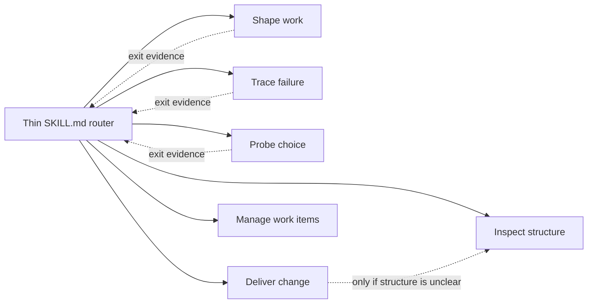

# Engineer Software

[](https://github.com/KirschBluteX/engineer-software/actions/workflows/ci.yml)

Engineer Software is a skills-only Codex plugin that routes substantive software work through one
focused, evidence-driven module at a time. It is designed to avoid both process inflation and the
architectural duplication that can be introduced by an otherwise correct fix or refactor.

## Design

The entry skill is intentionally thin. Codex first sees its metadata, reads `SKILL.md` only when the
skill applies, and then loads exactly one detailed reference for the current uncertainty.



The six modules are alternatives, not a mandatory pipeline:

| Module | Use it when |
| --- | --- |
| Shape work | Behavior, scope, compatibility, or acceptance is materially unresolved. |
| Trace failure | A symptom exists but the cause or mechanism is unknown. |
| Probe choice | A disposable experiment can answer one named decision. |
| Deliver change | The production outcome and edit boundary are ready to implement and verify. |
| Inspect structure | Evidence is needed for duplicated ownership, policy, state, or implementation. |
| Manage work items | The output is a local PRD, task set, or triage draft. |

Clear explanations and mechanical reversible operations bypass the workflow. Transitions occur only
after the active module produces evidence that identifies a different unresolved need.

GitHub is a distribution target, not a runtime route. The workflow has no GitHub branch, MCP server,
hook, telemetry process, hidden state machine, or external issue-tracker action. Work-item output
stays local unless a separate explicitly authorized workflow publishes it. See [PRIVACY.md](PRIVACY.md)
for the shipped data boundary.

## Install for the current user

Add the public Git repository as a marketplace, then install the plugin:

```powershell
codex plugin marketplace add KirschBluteX/engineer-software
codex plugin add engineer-software@engineer-software
codex plugin list
```

Start a new Codex task after installation so the new skill catalog is loaded. Invoke the plugin
explicitly with `$engineer-software`, or let Codex select it when a request matches the bounded skill
description.

To update an existing installation:

```powershell
codex plugin marketplace upgrade engineer-software
codex plugin add engineer-software@engineer-software
```

## Validate

Validation requires Python 3.9 or newer. Install the development-only YAML parser, then run every
local release gate:

```powershell
python -m pip install -r requirements-dev.txt
python scripts/validate_plugin.py plugins/engineer-software
python scripts/validate_evals.py
python scripts/validate_project.py
python -m unittest discover -s tests -v
python -m compileall -q scripts tests
```

`validate_plugin.py` enforces the stricter public-directory metadata and image limits in addition to
the local package shape. `validate_evals.py` verifies direct, indirect, follow-up, boundary, negative,
and every documented module-transition case. CI runs the same gates on the supported Python matrix.

Optional live routing evidence uses the installed plugin and a read-only ephemeral Codex task:

```powershell
python scripts/run_routing_eval.py --live --public-submission --output evals/runs/local-routing-results.json
```

See [evals/README.md](evals/README.md) for how to interpret environment-dependent model results.

## Release and public directory

The release workflow validates and packages the plugin when a matching `v*` tag is pushed. Before a
tag, update the SemVer release base, replace the single `+codex.<cachebuster>` suffix, update
[CHANGELOG.md](CHANGELOG.md), and run the full gate above.

Reviewer-ready listing copy, starter prompts, five positive cases, three negative cases, and release
notes are collected in [docs/public-submission.md](docs/public-submission.md). Public submission also
requires the publisher's verified OpenAI developer identity, region selection, policy attestations,
and a final portal action; those account-level choices are not stored in this repository.

## Support and license

Use [SUPPORT.md](SUPPORT.md) for bug-report details and [SECURITY.md](SECURITY.md) for private security
reports. Engineer Software is released under the [MIT License](LICENSE).
