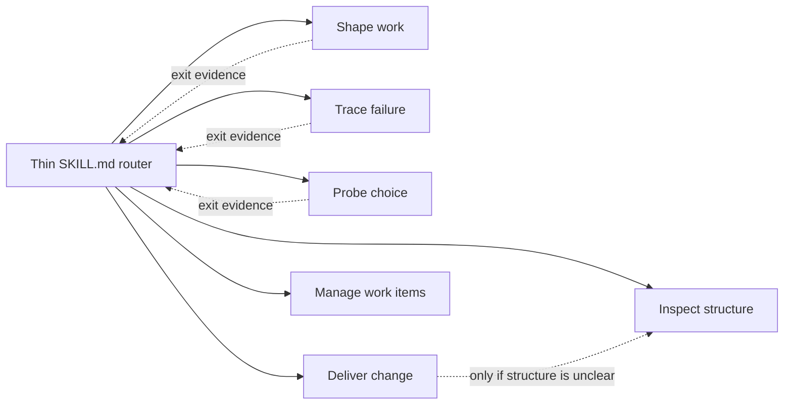

# Engineer Software

Engineer Software is an installable Codex skill that routes substantive software work through one
focused, evidence-driven module at a time. It is designed to avoid both process inflation and the
architectural duplication that can be introduced by an otherwise correct fix or refactor.

## Design

The entry skill is intentionally thin. Codex first sees its metadata, reads `SKILL.md` only when the
skill applies, and then loads exactly one detailed reference for the current uncertainty.



The six modules are alternatives, not a mandatory pipeline:

| Module | Use it when |
| --- | --- |
| Shape work | Behavior, scope, compatibility, or acceptance is materially unresolved. |
| Trace failure | A symptom exists but the cause or mechanism is unknown. |
| Probe choice | A disposable experiment can answer one named decision. |
| Deliver change | The production outcome and edit boundary are ready to implement and verify. |
| Inspect structure | Evidence is needed for duplicated ownership, policy, state, or implementation. |
| Manage work items | The output is a local PRD, task set, or triage draft. |

Clear explanations and mechanical reversible operations bypass the workflow. Transitions occur only
after the active module produces evidence that identifies a different unresolved need.

GitHub is a distribution target, not a runtime route. The workflow has no GitHub branch, MCP server,
hook, hidden state machine, or external issue-tracker action. Work-item output stays local unless a
separate explicitly authorized workflow publishes it.

## Install

Add this repository as a marketplace and install the plugin:

```powershell
codex plugin marketplace add KirschBluteX/engineer-software
codex plugin add engineer-software@engineer-software
```

Start a new Codex task after installation. Invoke it explicitly with `$engineer-software`, or let
Codex select it when the request matches the bounded skill description.

## Validate

The project uses only the Python standard library for its own checks:

```powershell
python scripts/validate_project.py
python -m unittest discover -s tests -v
```

The official Codex skill and plugin validators should also pass before release.

## License

MIT
