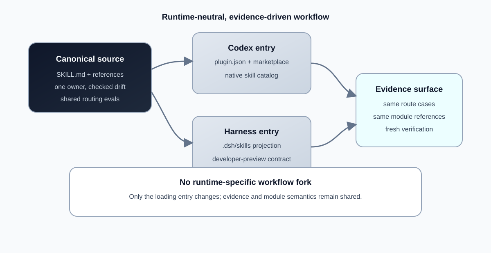
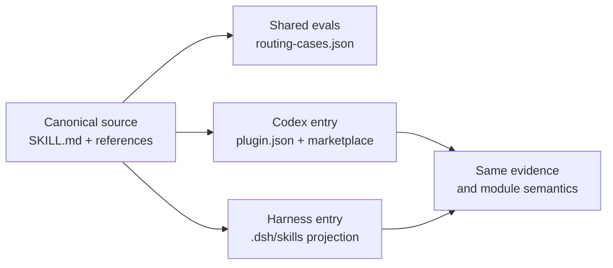

# Engineer Software

[](https://github.com/KirschBluteX/engineer-software/actions/workflows/ci.yml)

**A runtime-neutral, evidence-driven software engineering workflow for AI coding agents.**

[简体中文](README.zh-CN.md)

Engineer Software helps an agent choose the smallest trustworthy next move: close an unclear
contract, trace an unexplained failure, run one disposable probe, deliver a defined change, inspect
structural redundancy, or draft local work items. Codex and DeepSeek Harness are two first-class
loading paths over one canonical skill source; the workflow semantics and evidence fixtures stay
shared.




## 30-second overview

1. The thin router checks whether the request is ordinary work or has material engineering
   uncertainty.
2. It starts exactly one primary module and records the evidence needed to leave that module.
3. A later module is entered only when fresh evidence closes the current module and identifies a
   different need.
4. The same `SKILL.md`, references, and routing cases are available to both runtimes.



The projection is generated and checked; it is not a second hand-maintained workflow. See
[runtime compatibility](docs/compatibility.md) for the official Harness sources and the preview
status. The deterministic flow diagram is also available as
[SVG](docs/assets/runtime-neutral-flow.svg) for Markdown renderers without Mermaid support.

## Quick start

### Codex

```powershell
codex plugin marketplace add KirschBluteX/engineer-software
codex plugin add engineer-software@engineer-software
codex plugin list
```

Start a new task after installation, then ask for a substantive software change or invoke
`$engineer-software`. Upgrade with:

```powershell
codex plugin marketplace upgrade engineer-software
codex plugin add engineer-software@engineer-software
```

Remove it with the installed Codex plugin manager and confirm with `codex plugin list`. The existing
Codex marketplace manifest and plugin path remain unchanged.

### DeepSeek Harness

DeepSeek Harness is an official open-source project, currently marked **developer preview**. Its
official local skill provider scans project `.dsh/skills` roots. This checkout includes a generated
projection of the canonical skill:

```powershell
python scripts/sync_harness_skill.py --check
python scripts/validate_harness.py --check
npx @deepseek-ai/dsh web
```

Choose this repository as the Harness workspace and send a software-engineering request. To update
the projection after a canonical edit, run `python scripts/sync_harness_skill.py --write`; to remove
the project-local entry, remove the generated `.dsh/skills/engineer-software/` directory. A user-global
copy can target `$DSH_HOME/skills/engineer-software`; exact install and troubleshooting details are
in [runtime compatibility](docs/compatibility.md).

There is deliberately no guessed Harness manifest or claim of DeepSeek endorsement. The official
bundle format is for executable Cordis composition layers; a Markdown skill is correctly loaded from
the documented filesystem root. Live Harness/API behavior is not claimed as verified here.

## What it routes

| Primary module | Start when | Evidence to leave it |
| --- | --- | --- |
| Shape Work | behavior, compatibility, scope, or acceptance is open | smallest sufficient contract and exclusions |
| Trace Failure | a symptom exists but its cause is unknown | reproduction plus causal evidence |
| Probe Choice | one named decision needs a disposable experiment | observed result and decision consequence |
| Deliver Change | outcome and edit boundary are closed | focused check, implementation, final-state evidence |
| Inspect Structure | ownership or duplication is the question | traced owners, callers, and boundary recommendation |
| Manage Work Items | the requested output is a local PRD/task set | local artifact with acceptance and dependencies |

The six modules are alternatives, not a mandatory ceremony. Ordinary explanations, translations,
format-only work, and specified reversible file operations bypass the workflow.

## Real examples

These prompts are included in [`evals/routing-cases.json`](evals/routing-cases.json) and can be run
through the static fixture validator or the optional Codex runner:

- “Checkout sometimes creates a duplicate order under load. Find the cause and fix it.” →
  **Trace Failure** (the mechanism is unknown).
- “Build a disposable experiment to compare two state-transition models before we choose one.” →
  **Probe Choice** (one named decision, throwaway scope).
- “Add the documented `--json` flag to the existing status command and verify the specified output
  contract.” → **Deliver Change** (the contract is closed).
- “Explain what this function does and why it returns null here.” → **Bypass** (ordinary code
  reading).

Run deterministic routing checks without model access:

```powershell
python scripts/validate_evals.py
python scripts/validate_harness.py --check
python scripts/run_routing_eval.py --limit 5
```

Optional live Codex evidence is read-only and environment-dependent:

```powershell
python scripts/run_routing_eval.py --live --public-submission `
  --output evals/runs/local-routing-results.json
```

The Harness projection and the Codex runner use the same cases; no live Harness runner is implied.

## Validation

Use Python 3.9 or newer. The repository is standard-library-first; the development-only
`requirements-dev.txt` contains the YAML parser used by the validators.

```powershell
python -m pip install -r requirements-dev.txt
python scripts/validate_plugin.py plugins/engineer-software
python scripts/validate_evals.py
python scripts/validate_project.py
python scripts/validate_harness.py --check
python -m unittest discover -s tests -v
python -m compileall -q scripts tests
```

`validate_project.py` includes the Harness projection and documentation checks. CI keeps the Python
3.9/3.12/3.13 matrix and the same validation, routing, unittest, and compile checks. The workflow
does not enable `setup-python`'s pip cache because this repository has no `requirements.txt` or
`pyproject.toml` cache contract; the development file is installed explicitly.

## Compatibility, limits, and security

Read [docs/compatibility.md](docs/compatibility.md) for the matrix, install/upgrade/remove paths,
official DeepSeek Harness links, troubleshooting, and the exact “static only / live not verified”
boundary. The short version:

- DeepSeek Harness is a rapidly changing developer preview; compatibility-breaking changes are
  possible.
- The `.dsh/skills` tree is a generated projection. Edit the Codex canonical source and regenerate;
  drift fails validation.
- This project does not ship an MCP server, hook, telemetry, credential store, or background
  service. Tool permissions, API keys, and model configuration remain the user's runtime policy.
- Never commit API keys, `.env` files, session logs, profile state, generated temporary assets, or
  unreviewed screenshots.

GitHub is a distribution target, not a runtime route. This repository performs no issue-tracker,
telemetry, or remote workflow action when a skill is used. See [PRIVACY.md](PRIVACY.md),
[SECURITY.md](SECURITY.md), and [TERMS.md](TERMS.md).

## Contributing and roadmap

Start with [CONTRIBUTING.md](CONTRIBUTING.md). Keep `plugins/engineer-software/skills/engineer-software/`
as the only editable workflow source, run the projection check after changes, and add routing
fixtures for new transitions. [ROADMAP.md](ROADMAP.md) records the deliberately small next steps;
it does not promise a long-lived adapter framework.

## Copy-ready launch text

> Engineer Software is a runtime-neutral, evidence-driven workflow for AI coding agents. It routes
> substantive software work through one bounded module at a time, keeps Codex and DeepSeek Harness
> on one canonical source, and makes every transition carry fresh verification evidence.

Suggested GitHub description, topics, and homepage are recorded in
[`docs/public-submission.md`](docs/public-submission.md). They are recommendations only; this
repository does not call GitHub APIs or claim users, stars, adoption, or official sponsorship.

## License

Engineer Software is released under the [MIT License](LICENSE).
